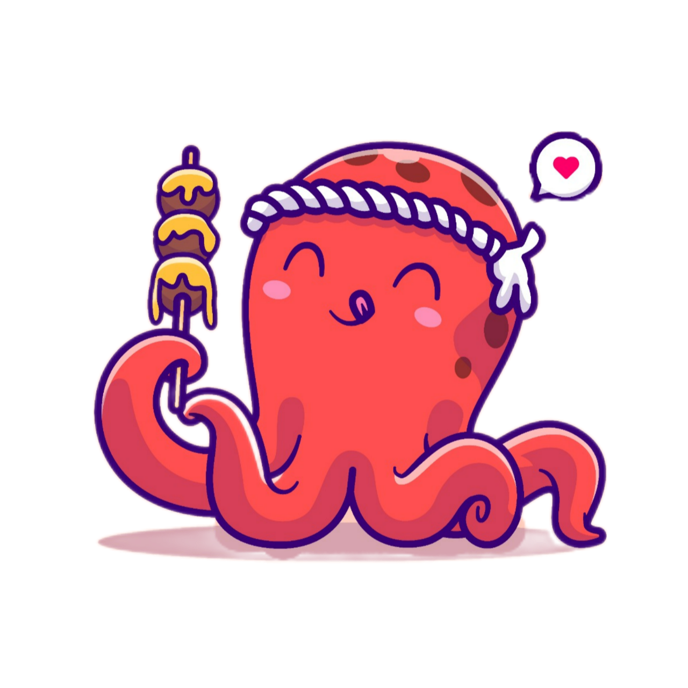

<!-- ╔════════════════════════════════════════════════╗
     ║           ZENITH HAWKING — PREMIUM             ║
     ║        Software Engineer GitHub Profile        ║
     ╚════════════════════════════════════════════════╝ -->

<!-- Wave Header -->

  
 

<!-- Contact Badges -->

  
  
  
  

<!-- Typing Intro -->
<h1 align="center">
  <picture>
    <!-- Dark mode -->
    <source media="(prefers-color-scheme: dark)"
            srcset="https://readme-typing-svg.demolab.com?font=Fira+Code&weight=600&size=24&pause=1000&color=7DB3FF&center=true&vCenter=true&width=720&lines=Hi%2C%20I%27m%20Zenith!;Software%20Engineer%20%7C%20.NET%20%2F%20SQL;Clean%20Architecture%20%26%20Microservices;Always%20Learning%20%F0%9F%93%9A">
    <!-- Light mode (same content as dark) -->
    
  </picture>
</h1>

<!-- About Me -->

<blockquote>
  <strong>Software Engineer based in Ho Chi Minh City 🇻🇳</strong> 
  Passionate about <strong>.NET, ASP.NET, and SQL</strong>, building scalable, clean, and maintainable systems — from web platforms to native applications. 
  Currently exploring <strong>Clean Architecture, Docker,</strong> and <strong>DevOps practices</strong>.
</blockquote>

- 💡 Product-oriented and detail-driven with a strong sense of usability  
- 🌱 Constantly learning: performance, security, and modern software design  
- 🧠 Working with: ASP.NET, SQL Server, Docker, MongoDB  

 

---

<!-- Tech Stack -->
<h2 align="center">🧰 Tech Stack</h2>

<!-- Focus / Learning -->
<h3>🎯 Focus & Learning</h3>
<ul>
  <li><strong>WEB</strong> — Creating modern, scalable, and user-focused web experiences with clean structure and accessibility in mind.</li>
  <li><strong>APPLICATION</strong> — Designing reliable and efficient desktop and cross-platform applications with strong architecture and maintainability.</li>
  <li><strong>API</strong> — Building secure, high-performance, and well-documented interfaces that connect systems seamlessly.</li>
  <li><strong>BACKEND</strong> — Structuring business logic and data flows with clarity, scalability, and long-term stability.</li>
  <li><strong>DEVOPS</strong> — Focusing on automation, deployment efficiency, and continuous improvement of the development lifecycle.</li>
</ul>

---

<!-- Featured Projects -->
<h2 align="center">🚀 Featured Projects</h2>

  
  

---

<!-- Quote -->
<h2 align="center">🌟 Thought of the Day</h2>

  

---

<!-- Trophies -->

<!-- Contact -->
<h2 align="center">🤝 Connect With Me</h2>

  
  &nbsp;&nbsp;
  
  &nbsp;&nbsp;
  

<!-- Footer -->

  

