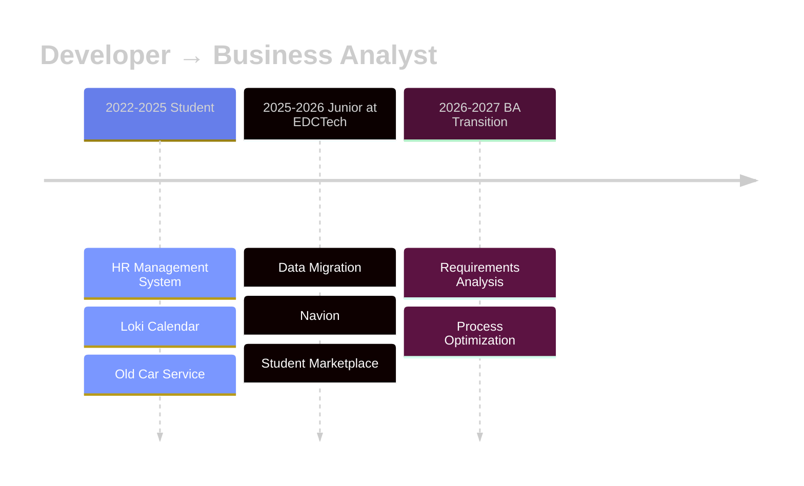
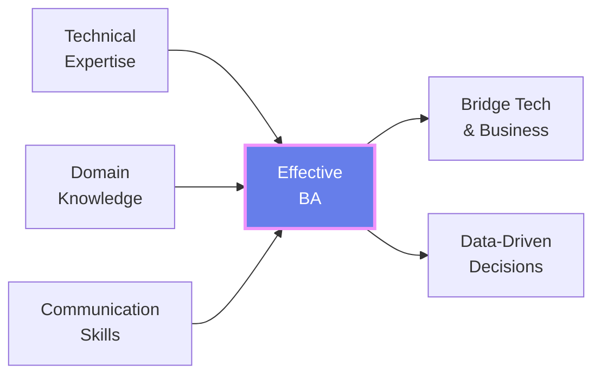

<div align="center">

<!-- ═══════════════════════════════════════════════════════════════════════ -->
<!--                              HERO SECTION                               -->
<!-- ═══════════════════════════════════════════════════════════════════════ -->

<h1>
  
</h1>

<h3>
  
</h3>

```diff
⚡ Nhanh hơn 1s cũng có thể tạo nên kỳ tích ⚡
```

<br/>

[](mailto:haitt200456@gmail.com)
[](https://www.linkedin.com/in/zenith-hawking-hai/)
[](https://github.com/ZenithHawking)

<br/>


</div>

---

<!-- ═══════════════════════════════════════════════════════════════════════ -->
<!--                         CAREER TIMELINE                                 -->
<!-- ═══════════════════════════════════════════════════════════════════════ -->

<div align="center">

## 🎯 CAREER JOURNEY



</div>

---

<!-- ═══════════════════════════════════════════════════════════════════════ -->
<!--                           TECH STACK                                    -->
<!-- ═══════════════════════════════════════════════════════════════════════ -->

<div align="center">

## 🛠️ TECH STACK

<table>
<tr>
  <td align="center" width="25%">
    <b>⚙️ Backend</b><br/><br/>
    <code>.NET Core</code><br/>
    <code>ASP.NET</code><br/>
    <code>Laravel</code><br/>
    <code>C#</code>
  </td>
  <td align="center" width="25%">
    <b>🎨 Frontend</b><br/><br/>
    <code>Vue.js</code><br/>
    <code>Blazor</code><br/>
    <code>HTML/CSS</code><br/>
    <code>JavaScript</code>
  </td>
  <td align="center" width="25%">
    <b>💾 Database</b><br/><br/>
    <code>MongoDB</code><br/>
    <code>SQL Server</code><br/>
    <code>Redis</code><br/>
    <code>PostgreSQL</code>
  </td>
  <td align="center" width="25%">
    <b>🔧 DevOps</b><br/><br/>
    <code>Docker</code><br/>
    <code>Git/GitHub</code><br/>
    <code>Linux</code><br/>
    <code>Azure</code>
  </td>
</tr>
</table>

</div>

---

<!-- ═══════════════════════════════════════════════════════════════════════ -->
<!--                       PROJECTS PORTFOLIO                                -->
<!-- ═══════════════════════════════════════════════════════════════════════ -->

<div align="center">

## 🚀 PORTFOLIO

</div>

<br/>

### 📦 Personal Products

<table>
<tr>
<td width="50%" valign="top">

#### 🏪 Hoa Vân Nhựa
**E-commerce platform for plastic materials**

- 🏗️ Microservices Architecture
- 💻 ASP.NET Core + Vue.js + MongoDB
- ✨ Product catalog, orders, payments, admin dashboard

</td>
<td width="50%" valign="top">

#### 🎨 IHateHTML
**Universal file-to-HTML converter**

- 🔄 Multi-format conversion to clean HTML/CSS
- 💻 Blazor WebAssembly + ASP.NET Core
- ✨ Drag-drop, real-time preview, batch processing

</td>
</tr>
</table>

<br/>

### 🌐 Open Source

<div align="center">

<a href="https://github.com/ZenithHawking/schools-api">
  
</a>

<br/><br/>

**Free API for Vietnam school information** • RESTful • 500+ schools • <100ms response

</div>

<br/>

### 🏢 Company Projects

<table>
<tr>
<td width="33%" align="center" valign="top">

**🔄 Data Migration**

Developer & PM

Multi-platform e-commerce migration

<br/>

`WordPress` `Haravan` `Nhanh` `Sapo`

</td>
<td width="33%" align="center" valign="top">

**⚡ Navion**

Developer

Enterprise solution platform

<br/>

`Feature Dev` `Deployment` `Integration`

</td>
<td width="33%" align="center" valign="top">

**🎓 Student Marketplace**

Full-Stack Developer

Campus e-commerce platform

<br/>

`Blazor` `Registration` `Email System`

</td>
</tr>
</table>

---

<!-- ═══════════════════════════════════════════════════════════════════════ -->
<!--                      BA TRANSITION                                      -->
<!-- ═══════════════════════════════════════════════════════════════════════ -->

<div align="center">

## 🎯 TRANSITIONING TO BUSINESS ANALYST

<table>
<tr>
<td width="50%" valign="top">

### Why BA?

- ✅ Bridge technical & business teams
- ✅ Leverage dev background for better requirements
- ✅ Data-driven decision making
- ✅ Process optimization & innovation

</td>
<td width="50%" valign="top">

### Current Focus

- 📊 Data analysis & visualization
- 📋 Requirements gathering & documentation
- 🗣️ Stakeholder management
- 🎯 Business process modeling

</td>
</tr>
</table>

<br/>



</div>

---

<!-- ═══════════════════════════════════════════════════════════════════════ -->
<!--                        GITHUB STATS                                     -->
<!-- ═══════════════════════════════════════════════════════════════════════ -->

<div align="center">

## 📊 GITHUB STATS

<!--  -->


<br/><br/>


</div>

---

<!-- ═══════════════════════════════════════════════════════════════════════ -->
<!--                           CONNECT                                       -->
<!-- ═══════════════════════════════════════════════════════════════════════ -->

<div align="center">

## 🤝 LET'S CONNECT


<br/><br/>

[](mailto:haitt200456@gmail.com)
[](https://www.linkedin.com/in/zenith-hawking-hai/)
[](https://github.com/ZenithHawking)

<br/>

**💼 Currently Open For:** BA Positions • Collaboration • Consulting

<br/><br/>

---


<br/>

<sub>💙 Crafted by Zenith Hawking • Updated Jan 2026</sub>

</div>
